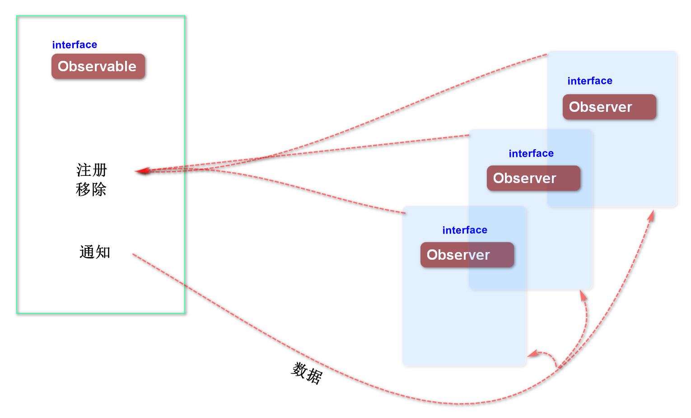
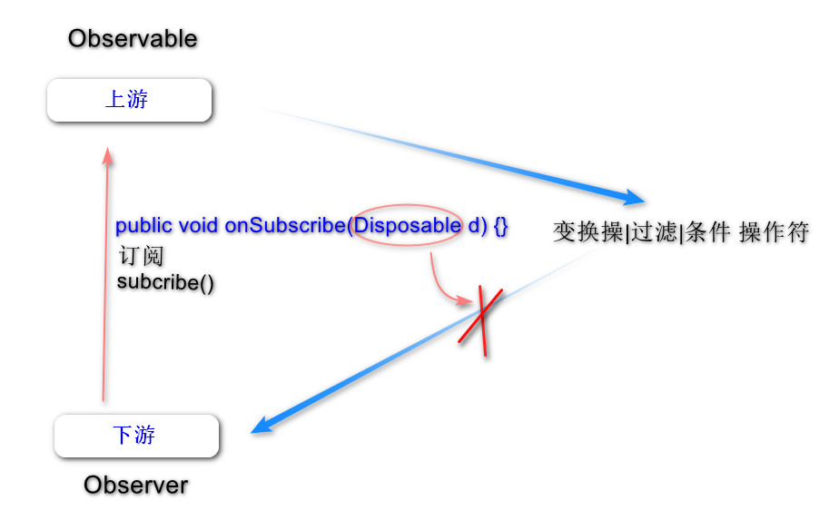

# AndRxJavaTalk
RxJava 复习

### 基础知识



#### Rxjava上游被观察者和下游观察者：



```java
/**
 * 日志顺序：
 *
 * D/RxJaJa---: 观察者， onSubscribe
 * D/RxJaJa---: 发射器发射事件
 * D/RxJaJa---: 观察者， onNext 接收了事件：11
 * D/RxJaJa---: 发射事件 11 完成
 * */

public class MainActivity extends AppCompatActivity {

    private Disposable d;

    @Override
    protected void onCreate(Bundle savedInstanceState) {
        super.onCreate(savedInstanceState);
        setContentView(R.layout.activity_main);

        // 被观察者
        Observable<Integer> observable = Observable.create(new ObservableOnSubscribe<Integer>() {

            @Override
            public void subscribe(ObservableEmitter<Integer> e) throws Exception {
                GLog.d("发射器发射事件");
                e.onNext(11);
                GLog.d("发射事件 11 完成");

                GLog.d("还想发射，可以吗？");
                // 可以补发事件，下面可以继续发射
                // 但如果 主动完成e.onComplete()，下面事件可以继续补发，但是观察者再也接收不到补发事件
                //e.onComplete();

                e.onNext(12);
                e.onNext(13);
                e.onNext(14);
                GLog.d("补发完成");
            }
        });

        // 观察者
        Observer<Integer> observer = new Observer<Integer>() {

            @Override
            public void onSubscribe(Disposable d) {
                GLog.d("观察者， onSubscribe");
                MainActivity.this.d = d;
            }

            @Override
            public void onNext(Integer integer) {
                GLog.d("观察者， onNext 接收了事件："+ integer);

                if (integer == 13){
                    // 下游切断事件，将不会接收后面的事件
                    d.dispose();
                }
            }

            @Override
            public void onError(Throwable e) {
                GLog.d("观察者， onError");
            }

            @Override
            public void onComplete() {
                GLog.d("观察者， onComplete");
            }
        };

        // 产生订阅事件
        observable.subscribe(observer);
    }
}
```

#### 各种操作符

 1. 创建操作符

   * **用来创建Observable的创建操作符**

     | 操作符    | 谁来发送事件       | 备注                                                         |
     | :-------- | :----------------- | ------------------------------------------------------------ |
     | create    | 使用者手动发送     | 单个事件                                                     |
     | just      | 内部会自己发送事件 | 可发送多个事件                                               |
     | formArray | 内部自己会发送事件 | 发送的事件是个数组                                           |
     | empty     | 内部自己会发送事件 | 上游自动发送空事件Object类型，下游无法确定事件类型,onComplete一定会被触发 |
     | interval  | 内部自己会发送事件 | 用于定时事件                                                 |
     | range     | 内部自己会发送事件 | 发送一串连续指定个数的事件序列                               |
     


  * **用来创建Observer的创建操作符**

    new Observer(...) 普通版
    new Consumer(...) 简化版，不需要覆写所有的方法如 onSubscribe， onComplete, onError()...
    
    

 2. **变换操作符**

    上游发送事件，下游接收事件，事件在上下游传递的过程中拦截，对事件变换，就要用到变换操作符

    |  操作符   |   作用    |  补充 |
    |  ------- |   ------- | -------|
    | map      |   可以连续多次变换，仍然是开始的那个被观察者  |      |
    | flatMap  |  转换后ObservableSource，会要求将变换后的事件用ObservableSource再次手动发送  |  不排序    |
    | concatMap|   转换后ObservableSource，会要求将变换后的事件再次手动发送  |   事件是排序的   |
    | groupBy  |   分组变换，拿到一个新的分组了的被观察者，需要继续手动订阅，观察者才能接收到分组了的事件  |      |
    | buffer   |   如果 多个事件不想全部发送，可以缓存到buffer分批次发送，批次根据buffer大小划分  |   仍然是开始的那个被观察者   |

 3. **过滤操作符**

     | 操作符 |  作用  |
     | ----- | ------ |
     | take |  take操作符只有和定时器Observable.interval一起使用才有意义 |
     | filter | 过滤事件，将要过滤的事件在操作符中返回false,观察者将不会收到已经被过滤的事件 |
     | distinct  | 过滤重复的事件 |
     | elementAt |  过滤指定下标/序号的事件，该事件将被接收，观察者收到被过滤的事件 |

 4. **条件型操作符**

    使用了条件操作符，观察者观察到的就是Boolean类型

    | 操作符  |  作用  |  应用场景 |
    | ------ | ----- | ------- |
    |  all   |  只要有一个条件是false,最终结果就返回false,类似java中的&& | 登录注册界面的判断，账户和密码规则都符合才允许登录   |
    |  contains | 是否包含一个条件，包含了就返回true,类似条件判断的\|\| |         |
    | isEmpty |  只要不为空就返回**true**  |          |
    | any     | 条件全部false,才是false,只要有一个是true，就是true ||

  5. **合并操作符**
     合并多个被观察者

     |  操作符     |    作用   |
     | ---------   | -------- |
     | concatWith | 与startWith相反； 观察者1.concatWith(观察者2)  会先收到观察者1再收到观察者2 |
     | startWith  | 解决多个被观察者先后顺序的问题； 观察者1.startWith(观察者2)  会先收到观察者2再收到观察者1 |
     | concat     | concat 最多能合并4个被观察者，按先后顺序依次执行 |
     | merge      | 最多能合并4个被观察者,并列执行没有先后顺序 |
     | zip        | 合并最多9个被观察者，多个事件的结果合并成为一个结果，观察者最后收到一个合并结果 |

  6. **异常操作符**

    RxJava如果不使用异常操作符，一旦出现异常，观察者会收到onError
    使用了异常操作符，观察者会在onNext()里收到异常
    
    异常操作符会捕获异常，交给下游。

| 操作符                | 作用                                                         |
| --------------------- | ------------------------------------------------------------ |
| onErrorReturn         | 能接收onError()，如果发生异常，会中断后面所有事件，观察者能收到异常，不会再接收到后面的事件 |
| onErrorResumeNext     | 能接收onError()， 返回一个被观察者，被观察者可以再次手动发送多个事件给下游 |
| onExceptionResumeNext | 能在发送异常时，捕获异常，可以发送异常标记                   |
| retry                 | 能捕获异常并重试，可以一直重试下去，也可以指定重试次数，指定重试条件(true重试，false不重试) |


      1. **线程切换**
    
     * 异步线程
        * Schedulers.io() ：代表io流操作，网络操作，文件流，耗时操作
        * Schedulers.newThread()    ： 比较常规的，普普线程
        * Schedulers.computation()  ： 代表CPU 大量计算 所需要的线程
    
     * main线程 主线程
        * AndroidSchedulers.mainThread()  ： 专门为Android main线程量身定做的
    
     * 给上游被观察者分配多次线程切换，只会在第一次切换，后面的不切换了即被忽略无效
     * 给下游观察者分配多次，每次都会去切换线程

### 背压

    背压模式的由来：
    
         RxJava1.X的时候，还没有背压模式， 我们的上游不停的发射，我们的下游处理不过来，就会照成内存泄漏
         RxJava2.X之后，增加背压模式，Observable  Flowable（解决背压）

```java

Flowable.create(
    new FlowableOnSubscribe<Integer>() {
            @Override
            public void subscribe(FlowableEmitter<Integer> e) throws Exception {
                // 上游不停的发射大量事件
                for (int i = 0; i < Integer.MAX_VALUE; i++) {
                    e.onNext(i);
                }
                e.onComplete();
            }
        },
    BackpressureStrategy.MISSING)
                .subscribeOn(Schedulers.io())
                .observeOn(AndroidSchedulers.mainThread())
                .subscribe(/* Observer... */);
```

  * 背压策略

    * BackpressureStrategy.ERROR  上游不停的发射大量事件，下游阻塞了处理不过来，放入缓存池，如果池子满了，就会抛出异常
    * BackpressureStrategy.BUFFER 上游不停的发射大量事件，下游阻塞了处理不过来，放入缓存池，”等待“下游来接收事件处理
    * BackpressureStrategy.DROP 上游不停的发射大量事件，下游阻塞了处理不过来，放入缓存池，如果池子满了，就会把后面发射的事件丢弃
    * BackpressureStrategy.LATEST 上游不停的发射大量事件，下游阻塞了 处理不过来，只存储 128个事件


### 总结

上游Observable 下游Observer

上游Flowable 下游Subscriber

如果上游要发送大量事件，下游有来不及处理的情况，就应该用背压

用背压如果onSurber()中不设置request，则上游会阻塞并抛出异常


